# Module-21-Challenge
# KaseiCoin Crowdsale Deployer

---

## <i>Overview of the Analysis</i>

---

## <b>Purpose:</b>

The purpose of this software project is to develop a beta-tested monetary system for a fictitious Mars Colony economy. THe new monetary system will incorporate blockchain technology to create a new cryptocurrency named KaseiCoin. KaseiCoin will be a fungible token that is ERC-20 compliant. This project will enable distribution of KaseiCoin tokens via a crowdsale Solidity program where people can convert fiat -> ETH -> KaseiCoin (KSIC). 

---

## <b>Process & Variables:</b>

The sequence of steps in this project are as follows:
<ol> 
Step 1: Create the KaseiCoin token contract.
 
Step 2: Create the KaseiCoin crowdsale contract.
 
Step 3: Create the KaseiCoin deployer contract.
 
Step 4: Deploy the crowdsale to a local blockchain (Custom RPC Local Testnet w/ MetaMask as the Injected Provider).
 
Step 5: Optional: Extension of the crowdsale contract via OpenZeppelin imported contract inheritance. </ol>

### <b><u>Step 1: Create the KaseiCoin Token Contract</b></u>
 
i.) Create a template KaseiCoin.sol starter file in the Remix IDE. 
 
ii.) Import the following contracts from the OpenZeppelin library:  
 
<ol> a.) ERC20
  b.) ERC20Detailed
  c.) ERC20Mintable
</ol>
iii.) Define a contract for the KaseiCoin token named 'KaseiCoin' & have the contract inherit the three above listed imported contracts from OpenZeppelin.
 
iv.) In the 'KaseiCoin' contract, a constructor with the following parameters is added: 'name', 'symbol', & 'initial_supply'. 
 
v.) In the constructor definition, a call to the constructor of the 'ERC20Detailed' contract is instantiated with 'name', 'symbol' and '18' (*18 = 'decimal' parameter) parameters are included. 
 
vi.) The contract is compiled via the 0.5.5 version of the compiler.
 
 

### <u><b>Step 2: Create the KaseiCoin Crowdsale Contract (KaseiCoinCrowdsale)</b></u>
 
i.) A KasieCoinCrowdsale.sol template file is initiated, again, in the Remix IDE.
 
ii.) The above contract file inherits the following OpenZeppelin contracts: 
 
<ol> a.) 'Crowdsale'
  b.) 'MintedCrowdsale' </ol>
 
iii.) Within the 'KaseiCoinCrowdsale' constructor, the following parameters are provided as features to the crowdsale (i.e. 'rate, 'wallet' & 'token'). The 'wallet' will be the payable wallet where the deposited funds (in ETH/wei) will be sent. The 'token' will be associated with the KaseiCoin contract .sol file that creates the actual token to be sold at crowdsale.
 
iv.) The contract is compiled via the 0.5.5 version of the compiler.
 
 

### <u><b>Step 3: Create the KaseiCoin Deployer Contract (KaseiCoinCrowdsaleDeployer)</b></u>
 
i.) Next, the 'KaseiCoinCrowdsaleDeployer' contract is generated within the 'KaseiCoinCrowdsale.sol' code.
 
ii.) Within the 'KaseiCoinCrowdsaleDeployer' contract, variables are added in order to store the addresses of the 'KaseiCoin' and 'KaseiCoinCrowdsale' contracts (which the 'KaseiCoinCrowdsaleDeployer' will inevitably be coded to deploy).
 
iii.) An 'address public' variable named 'kasei_token_address' is generated in order to store the 'KaseiCoin' address when the contract has been deployed.
 
iv.) An 'address public' variable named 'kasei_crowdsale_address' is generated in order to store the 'KaseiCoinCrowdsale' address when the contract has been deployed via the 'KaseiCoinCrowdsaleDeployer' contract. 
 
v.) The following parameters were then added to the 'KaseiCoinCrowdsaleDeployer' contract: 'name', 'symbol', & 'wallet'. 
 
vi.) The following additions are then coded into the constructor body of the 'KaseiCoinCrowdsaleDeployer' contract:
 
<ol> a.) A new instance of the 'KaseiCoin' token is instantiated by creating a 'token' object. It carries the 'name', 'symbol', and 'initial_supply' (where 'initial_supply' is swapped with '0' value as an initial variable value). 
  b.) The address of the 'KaseiCoin' object 'token' is set to the 'kasei_token_address' variable.
  c.) A new instance of the 'KaseiCoinCrowdsale' contract is instantiated as 'sale' object with the following parameters set: 
<ul> 'rate': 'rate' is set to 1 to maintain parity with ether's wei.
  'wallet': 'wallet' is passed from the main constructor. This is the wallet where the crowdsale funds will be stored when raised.
  'token': 'token' is the variable where the newly instantiated KaseiCoin object is stored. 
</ul> 
 
vii.) The address of the 'KaseiCoin' crowdsale contract is set to the 'kasei_crowdsale_address'. 
 
viii.) The 'KaseiCoinCrowdsale' contract is set as minter.
 
ix.) The 'KaseiCoinCrowdsaleDeployer' renounces its minter role.
 
x.) The contract is compiled via the 0.5.5 version of the compiler.
</ol>
 
 

### <u><b>Step 4: Deployment of the Crowdsale to a Local Blockchain</b></u>
 
i.) Deployment of the crowdsale to the local blockchain is accomplished using Remix, MetaMask & Ganache.
 
ii.) Functionality of the crowdsale is beta-tested by buying new tokens & then checking the balances of the payee & beneficiaries.
 
iii.) The total supply of the minted tokens & amount of wei the crowdsale contract has been raised is recorded & accounted for during testing.
 
 

### <u><b>Step 5: Extension of the Crowdsale Contract Via OpenZeppelin</b></u>
 
The following section enables enhanced functionality of the crowdsale by invoking additional imported contract features.
 
i.) Three additional OpenZeppelin contracts are added to the 'KaseiCoinCrowdsale.sol' contract: 
 
 
<ol> import "https://github.com/OpenZeppelin/openzeppelin-contracts/blob/release-v2.5.0/contracts/crowdsale/validation/CappedCrowdsale.sol";
'CappedCrowdsale': This library contract enables the capping of the total amount of ETH that the crowdsale can raise. 
 
  import "https://github.com/OpenZeppelin/openzeppelin-contracts/blob/release-v2.5.0/contracts/crowdsale/validation/TimedCrowdsale.sol";
 
'TimedCrowdsale': This library contract enables a set time limit for the crowdsale by adding both an opening & closing UNIX timestamp feature.
 
  import "https://github.com/OpenZeppelin/openzeppelin-contracts/blob/release-v2.5.0/contracts/crowdsale/distribution/RefundablePostDeliveryCrowdsale.sol";
'RefundablePostDeliveryCrowdsale': This import adds the ability to refund investors of the crowdsale. (When the crowdsale is initially launched, the deployer is able to set the goal of the amount of ETH to be raised. If the user fails to achieve the target goal, the investors that did fund the crowdsale wallet, are refunded). </ol>
 
ii.) The 'KaseiCoinCrowdsale' contract then inherits the following three imported contracts listed & described above.
 
iii.) Additionally, within the 'KaseiCoinCrowdsale' constructor, the following parameters are added: 
 
<ol> uint goal: This variable represents the amount of ETH that is needed to be raised at a minimum during the crowdsale.
  
uint open: This represents the opening time for the crowdsale.
  
uint close: This variable represents the closing time for the crowdsale. </ol>
 
iv.) The 'KaseiCoinCrowdsale' constructor body code is modified as follows: 
 
 
<i>
constructor( 
        &emsp; &emsp; uint256 rate, // rate in token bits  
        &emsp; &emsp; address payable wallet, // sale beneficiary  
        &emsp; &emsp; KaseiCoin token, // the KaseiCoin itself that the KaseiCoinCrowdsale will work with  
        &emsp; &emsp; uint goal, // the crowdsale goal  
        &emsp; &emsp; uint open, // the crowdsale opening time  
        &emsp; &emsp; uint close // the crowdsale closing time  
    &emsp;) public  
        &emsp; &emsp; Crowdsale(rate, wallet, token)  
        &emsp; &emsp; CappedCrowdsale(goal)  
        &emsp; &emsp; TimedCrowdsale(open, close)  
        &emsp; &emsp; RefundableCrowdsale(goal)  
    &emsp; {  
        // constructor can stay empty  
    &emsp; }  
</i>
 

v.) The 'KaseiCoinCrowdsaleDeployer' contract ultimately acts as an auto-deployer for the updated 'KaseiCoinCrowdsale' contract. Within the constructor of the deployer contract ('KaseiCoinCrowdsaleDeployer'), a new 'uint' parameter called 'goal' is added that enables the user/deployer to set the appropriate crowdsale goal. 
 
vi.) Next, the 'KaseiCoinCrowdsale' contract is then updated with the newly added imported contract features & associated parameters. The new finished object instantiation of a newly invoked 'KaseiCoinCrowdsale' contract appears as follows: 
 
<ol><i> KaseiCoinCrowdsale kasei_crowdsale = new KaseiCoinCrowdsale (1, wallet, token, goal, now, now + 10 minutes); </i></ol>
 
vii.) Finally, the updated contracts are finalized by completing the following: 
 
<ol> a.) The 'KaseiCoinCrowdsale' contract is again re-compiled and ETH is sent to the crowdsale from a different account to add to the fundraiser.
  b.) The 'close' time is then set to 'now + 10 minutes' for beta-testing purposes.
  c.) The minimum goal and cap targets (*Note: goal = 300 ETH for testing purposes) are then met by sending ETH from an external MetaMask account by using the Custom RPC local testnet. 
  d.) Within MetaMask & Ganache, the ETH coin & KSIC token exchanges are then reviewed and confimed for correct functionality between all contributor/beneficiary accounts. </ol>
 
 

---

## <b>Results:</b>

<u> 1.) Initial KaseiCoin Contract Compiled: </u>

  

  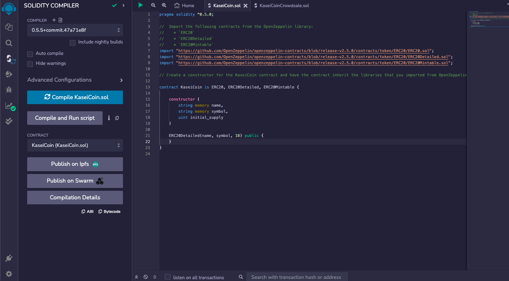
  

  <i>Basic confirmed compiling of the standard KaseiCoin contract .</i>
   
   

<u> 2.) Initial KaseiCoinCrowdsale Contract Compiled:</u>

  

  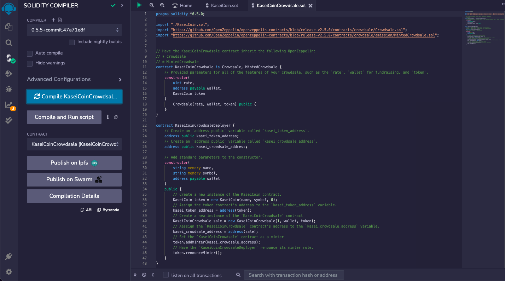
  

  <i>Basic confirmed compiling of the standard KaseiCoinCrowdsale contract .</i>
   
   

<u> 3.) KaseiCoinCrowdsaleDeployer (Pre-Deployment Stage 1):</u>

  

  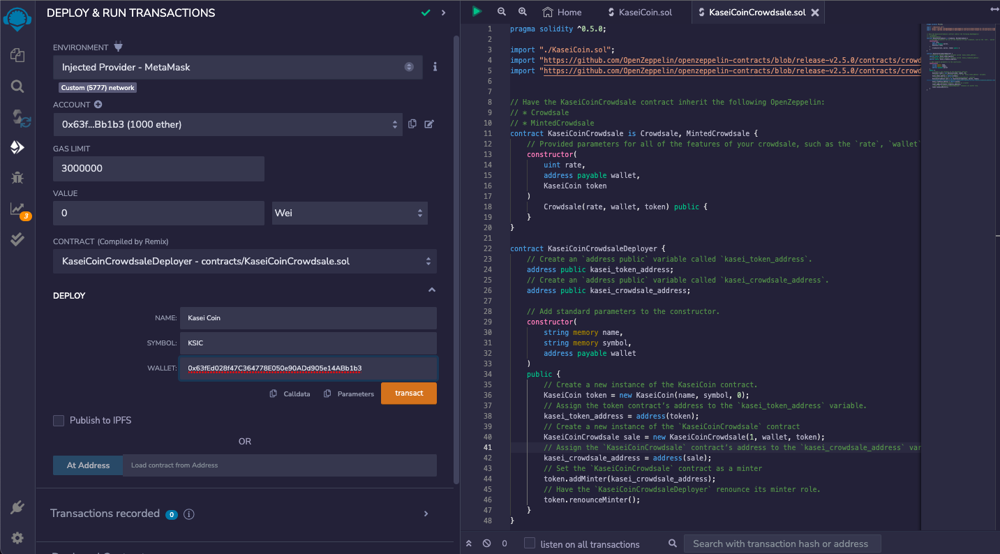
  

  <i>Above, the wallet address of the deployer is also used as the payable address for funds collected at '0x63fEd...Bb1b3' as noted in the Remix IDE 'Account' field. Additionally, note in the 'Deploy' IDE section the 'Name' is set to 'Kasei Coin' and 'Symbol' is set to 'KSIC'. The 'Wallet' is set to '0x63fEd...Bb1b3'.</i>
   
   

<u> 4.) KaseiCoinCrowdsaleDeployer (Pre-Deployment Stage 2):</u>

  

  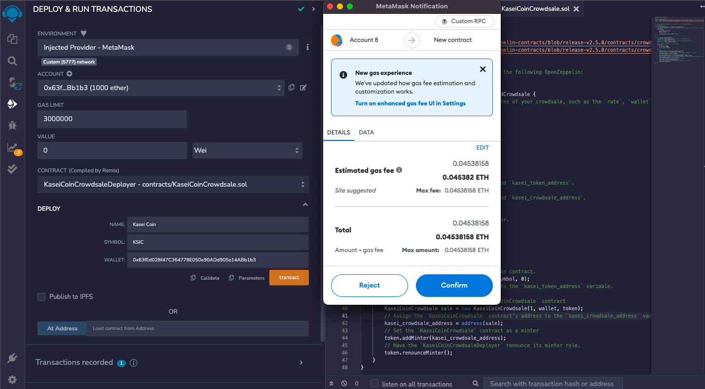
  

  <i> Illustrated above, wallet address '0x63fEd...Bb1b3' is about to spend 0.045382 ETH in order to initiate the 'KaseiCoinCrowdsaleDeployer' contract. This inevitably deploys both the 'KaseiCoin' & 'KaseiCoinCrowdsale' contract, simultaneously. </i>
   
   

<u> 5.) KaseiCoinCrowdsaleDeployer (Deployment Completed):</u>

  

  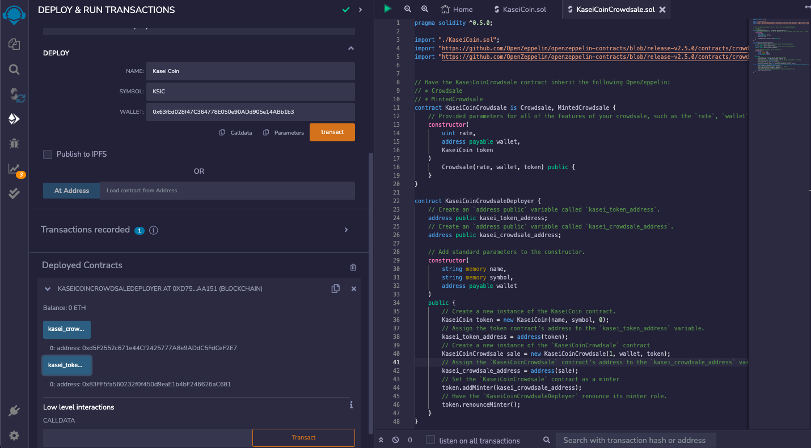
  

  <i> Note: In the bottom left corner of the Remix IDE 'Deployed Contracts' window, the addresses of both the 'kasei_crowdsale_address' & 'kasei_token_address' can be called to display their addresses (in hash format). This is important since they can be easily copy/pasted via this call command later on.</i> 
   
   

<u> 6.) KaseiCoinCrowdsale Deployed:</u>

  

  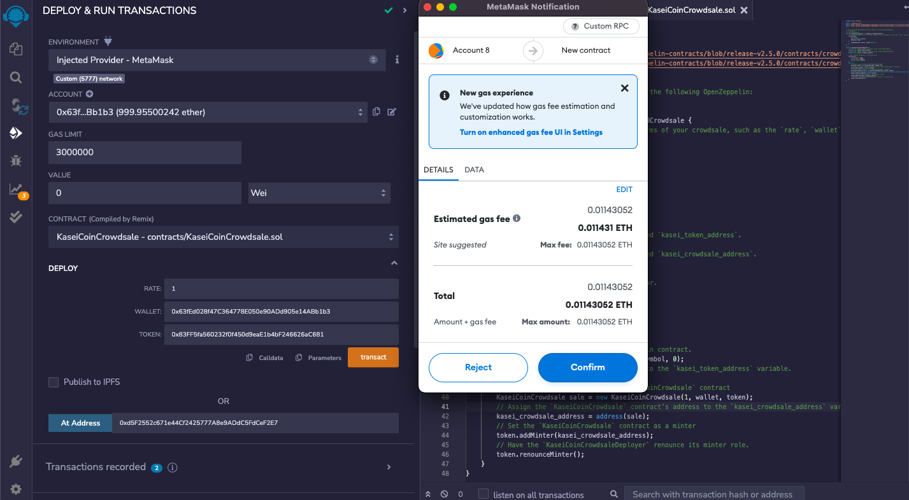
  

  <i>Above, 'Account 8' is used to set the 'KaseiCoinCrowdsale' address to 'Wallet = 0x63fEd028f47C364778E050e90ADd905e14ABb1b3'. Additionally, the token contract address is confirmed to be set as '0x83...C681'. </i>
   
   

<u> 7.) KaseiCoinCrowdsale Contract - Sample 10 ETH-to-KSIC Purchase From Wallet '...Bb1b3' (Account 8)</u>

  

  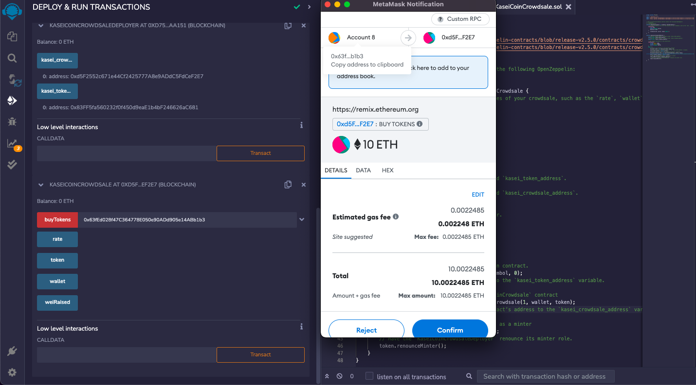
  

  <i> Illustrated above, is a test purchase of 10 ETH from 'Account 8' to the KaseiCrowdsale contract of 'Oxd5E...F2E7'. This is ultimately routed to to the same '...Bb1b3' wallet that the crowdfund contract is attached to, so is not the best illustration of funds transparently transferred and displaying a net difference. The next purchase/transfer example will make this more obvious & transparent. </i>
   
   

<u> 8.) KaseiCoinCrowdsale Contract - Sample 25 ETH-to-KSIC Purchase From Wallet '...9b726' (Account 9)</u>

  

  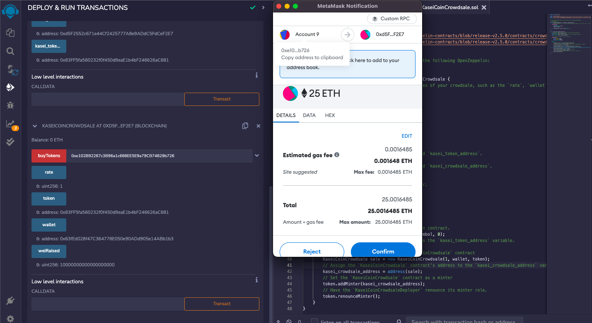
  

  <i> Illustrated above, is a more transparent crowdsale transaction in which wallet '...9b726' (Account 9) purchases 25 ETH worth of KSIC token and is transferred via KaseiCrowdsale contract of 'Oxd5E...F2E7' and routed to the assigned funds holder at wallet '...Bb1b3' (Account 8). </i>
   
   

<u> 9.) KaseiCoinCrowdsale Contract - Ganache Purchase Summary</u>

  

  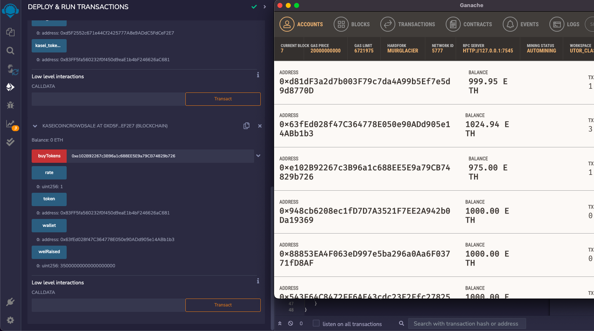
  

  <i> This snapshot of Ganache illustrates the test ETH purchase/transfers for the KaseiCoin crowdsale up until this point. </i>
   
   

<u> 10.) KaseiCoinCrowdsale Contract - MetaMask KSIC Total of 25-KSIC on Wallet '...9b726' (Account 9)</u>

  

  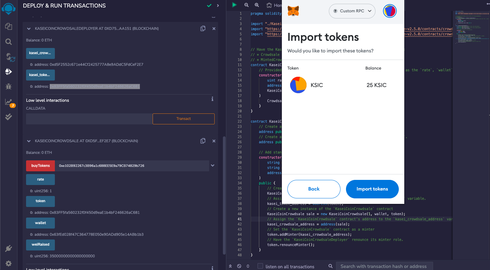
  

  <i> Above, wallet '...9b726' (Account 9) displays the MetaMask holdings of the KSIC token being tested. Account 9 currently holds 25-KSIC tokens, as illustrated in the transaction that took place in part 8, above. </i>
   
   

  <u> 11.) KaseiCoinCrowdsale Contract - MetaMask KSIC Total of 25-KSIC on Wallet '...Bb1b3' (Account 8)</u>

  

  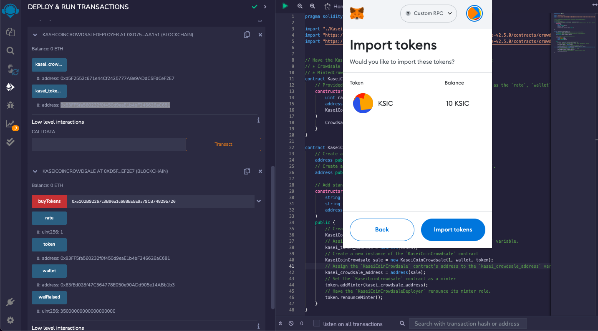
  

  <i> Above, wallet '...Bb1b3' (Account 8) displays the MetaMask holdings of the KSIC token being tested. Account 8 currently holds 10-KSIC tokens, as illustrated in the transaction that took place in part 7, above. </i>
   
   

  <u> 12.) KaseiCoinCrowdsale Contract - Optional Pt 1 Contract Functionality Extension</u>

  

  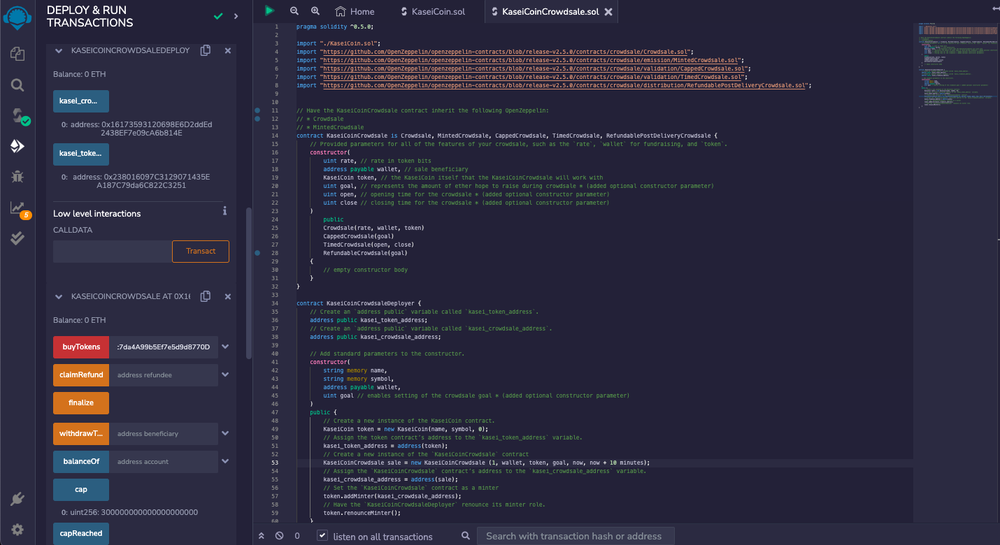
  

  <i> Additional imported contract & function libraries are added to the original KaseiCoinCrowdsale & KaseiCoinCrowdsaleDeployer contracts. Here, functionality is added in order to add crowdsale goal & cap values as well as a start & end time (open & close time) for the crowdsale as customization features. Here, wallet address 0xd81dF3a2d7b003F79c7da4A99b5Ef7e5d9d8770D is employed as the primary token purchaser. </i>
   
   

  <u> 13.) KaseiCoinCrowdsale Contract - Optional Pt 2 Contract Functionality Extension</u>

  

  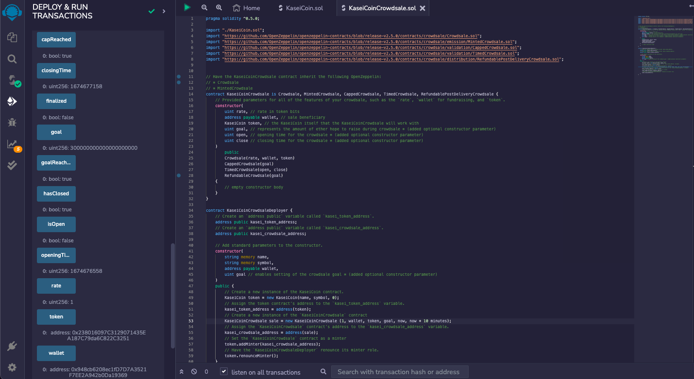
  

  <i> The above snapshot illustrates the final state of the crowdsale contract after all call functions are invoked in order to display the final state. As can be seen, the goal of 300 ETH was reached (via funding from two separate token purchases from wallet 0xd81dF3a2d7b003F79c7da4A99b5Ef7e5d9d8770D (Account 7). It can be noted that the goalReached bool equals true, as does isOpen equals false (indicating the crowdsale closed), as well as capReached equaling true. Note, however, this snapshot was taken before the 'finalized' function has been selected and payed for (with gas). The funds can also be shown to be ultimately sent and routed to wallet 0x948cb6208ec1fD7D7A3521F7EE2A942b0Da19369 (Account 10). </i>
   
   

  <u> 14.) KaseiCoinCrowdsale Contract - Optional Pt 3 300-KSIC Withdrawal </u>

  

  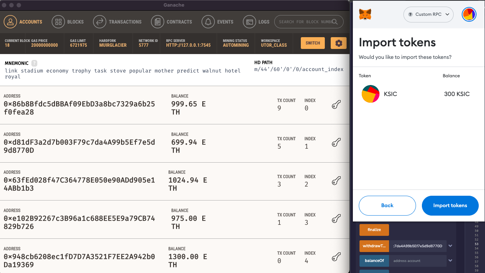
  

  <i> Illustrated above in the MetaMask snapshot, it must be noted that the 300-KSIC tokens were ultimately sent and routed to wallet 0xd81dF3a2d7b003F79c7da4A99b5Ef7e5d9d8770D (Account 7), while wallet 0x948cb6208ec1fD7D7A3521F7EE2A942b0Da19369 (Account 10) was alotted the 300 ETH in return. </i>
   
   

## <b>Summary:</b>

In summary, the functionality of the KaseiCoin token & KaseiCoinCrowdsale contracts proved successful in their implementation and beta-testing and prove a worthy solution to a separate alternative monetary system that could benefit from a decentralized currency. This could be especially true when tested in experimental & specialized micro-economies.  
